## Definition:
A gun that can be thrown into the back of a truck, the cabin of a van, or carried on foot through harsh environments for an unknown amount of time and remain useful throughout.

## Requirements:
* Weapon light.
* Storage for ammo and batteries.
* High tolerances and easy to clear of malfunctions.
* Easy to teach others to operate.
* Dependable carry system.
* Usable out to at least medium ranges.

## Weapon: Rossi Model 62 Pump-Action 22lr

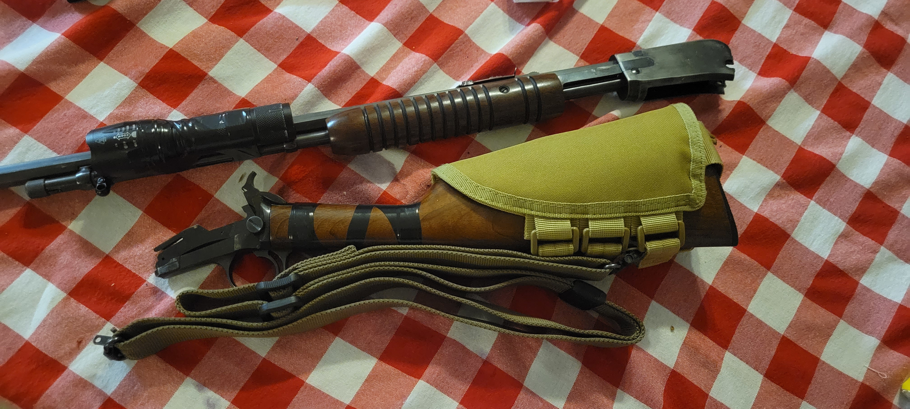

I do want to make it clear, that there are lots of weapons that would meet the above requirements. This is just what I had access to for this setup.

As far as the 22lr cartridge is concerned, range is definitely a problem. But, with hyper velocity ammo and the generous 22.50 inch barrel, I can hit targets out to 100 yards without issue. And that's enough into medium range for me. I seem to have the best luck with CCI Stingers for those long shots.

The takedown feature of this model is a pretty big deal as well. Not only because it makes transporting it easier. The biggest benefits, in my book, are that it makes cleaning and troubleshooting so much faster. It's important to remember that you could be relying on this gun for continuous use for a long time, and you need something you can maintain with minimal time and materials.

## Customization

Working on a tight budget, I got most of my accessories off of Amazon. But, I have been running them through their paces with regular training sessions and they are holding up well.

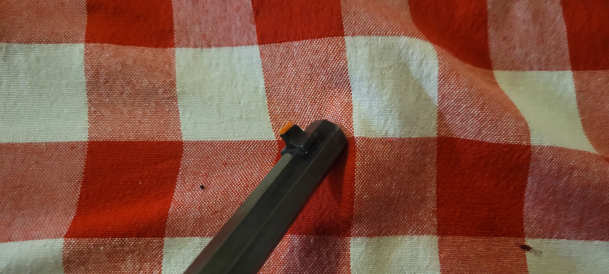

One of the previous owners of this firearm ground down the front sight post. This was a pretty common modification for guns at the time, from what I gather. But, it does not work well for me in the accuracy department. I carved a triangular prism from some bright orange plastic which I had laying around and then glued it to the top of the sight post. It has held up well, and gives a nice crisp arrow pointing to the center of the target.

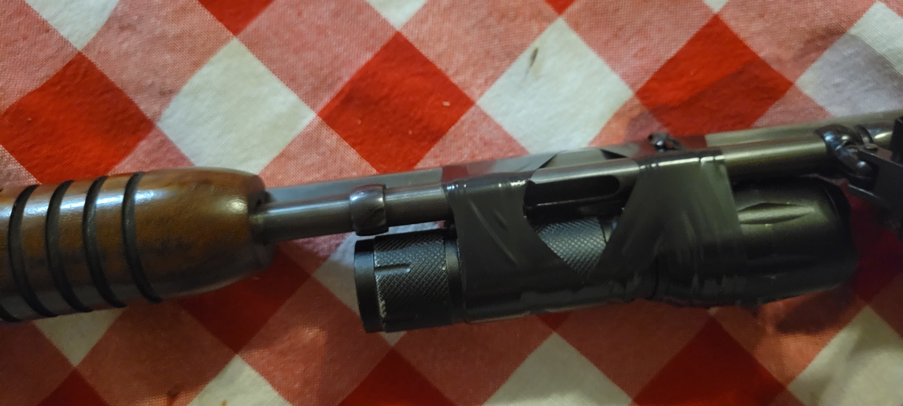

Next, I taped on a cheap flashlight. Well this is far from aesthetically appealing, it works just fine. I did have to pattern the tape to avoid covering the access port on the magazine tube.

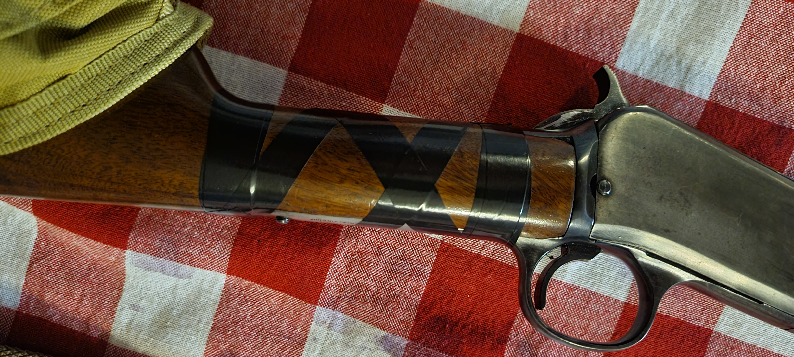

Since I was taping things up, I also added some reinforcement to where the tang attaches to the stock of the rifle. This seems to be a flex point in this gun, especially when I put a lot of pressure on the sling to stabilize longer shots. On the plus side, the tape provides some nice extra grip.

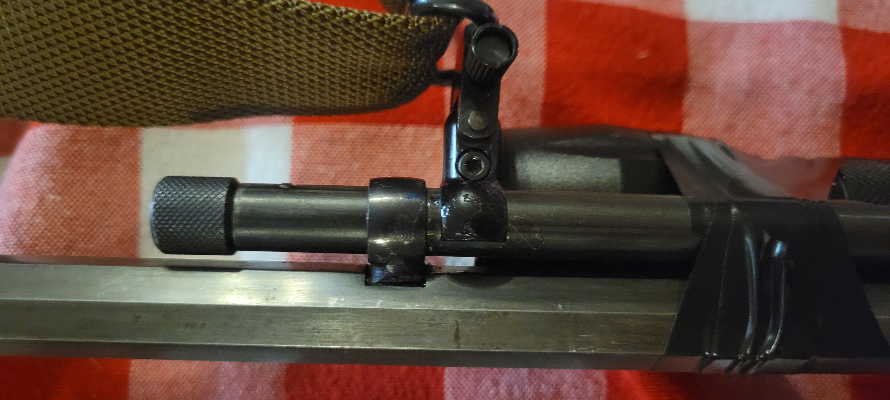

I attached a sling stud to the magazine tube. The band coming from the barrel is the most stable part of the tube, so I would advise keeping the mount as close to that as possible. I also sealed up the attachment with clear lacquer (a gel top-coat for use with nail polish) which seemed to take away the side to side wiggle it used to have.

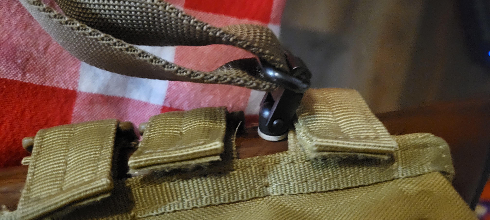

I put in a standard screw sling stud on the stock of the rifle as well.

For my sling I used a [Magpul RLS](https://www.amazon.com/dp/B07DNXHK6N). It's an affordable sling, and one of the few that offers stabilization and speed of adjustment. It's not the most comfortable, but given the light weight weapon, that's not a deal breaker for me right now.

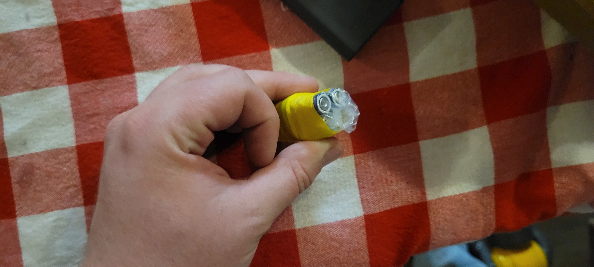

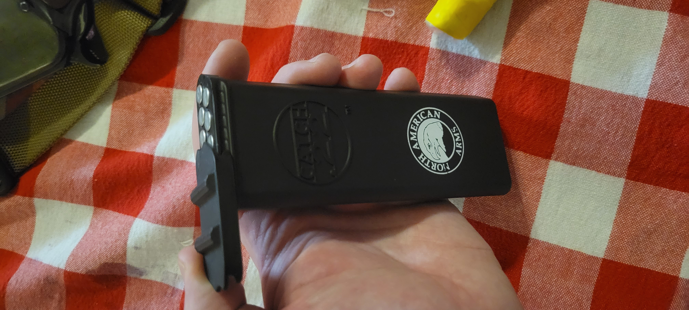

Inside the pouch I put a ziploc-ed and taped roll of batteries and a quick-loader meant for tube-fed 22lr rifles. I used the [NAA Catch-22](https://www.amazon.com/dp/B00AQ67AI8). Another great advantage of this cartridge is that there's 50 rounds in that loader and it doesn't weigh the rifle down.

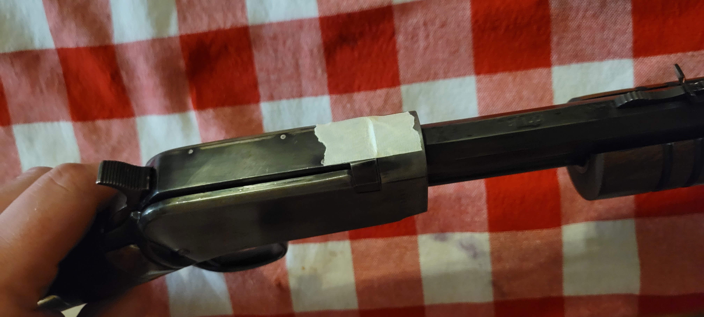

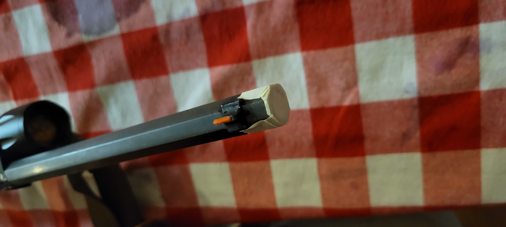

Also, I always make sure to tape up the end of the barrel and the top of the bolt. This helps keep debris from getting in the only places where it would be catastrophic. For this I use masking tape, but any tape should be fine. The masking tape breaks easily off the bolt when you cycle the action, which is a big plus for me.

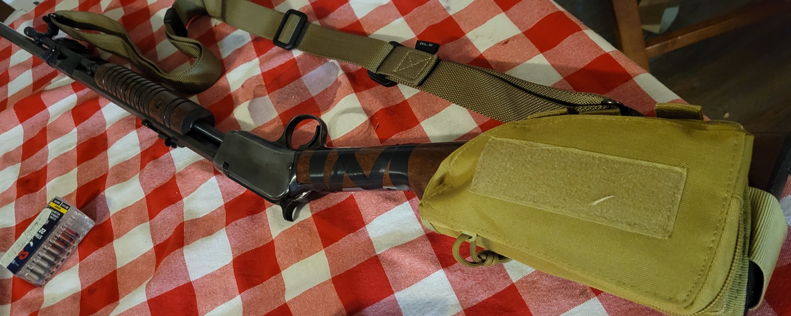

Finally, before storing the gun, I make sure to load the tube but leave the chamber empty. This puts the total cartridges in the kit at a whopping 63. The longer hyper-velocity ammo means the 15-round tube becomes a 13-round tube. You could squeeze in a couple more rounds by using standard ammo, but the performance boost seems worth the tradeoff to me.

Leaving the chamber loaded isn't an option for me, especially with a gun that has no internal safety mechanisms. The "safety" position of clicking back the hammer just isn't reassuring enough for storage.

## Final Thoughts

This thing is pretty ugly. Worthy of [r/CursedGuns](https://www.reddit.com/r/CursedGuns/) more likely than not. But, it fills the role I need it to quite well. Now it waits up on my wall, ready to go at a moment's notice.

I would definitely suggest considering a bail-out gun setup. As you can see above, it doesn't need to be fancy or costly, just a practical tool to see you through should worst come to worst.

---

> These men are all talk; What is needed is action - action!  
> **John Brown**