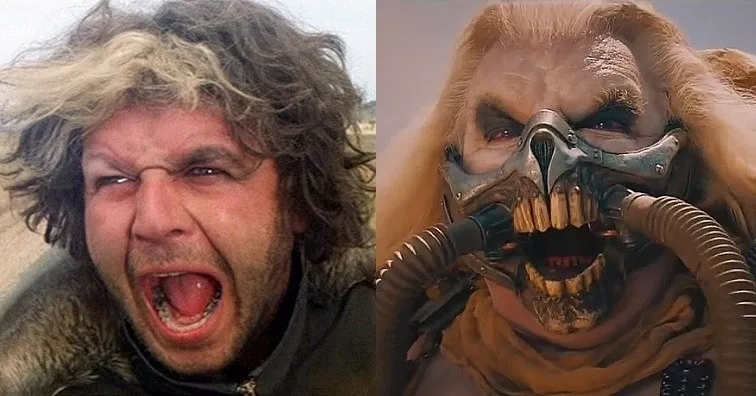

When you start talking to other people about anarchism visions of Immortan Joe and Toecutter dance through minds and they say things like:
"What so you just want utter chaos?"

*([Hugh Keans-Byrne](https://www.reddit.com/r/MovieDetails/comments/dhmq3w/hugh_keansbyrne_has_played_the_lead_antagonist_in/?utm_source=share&utm_medium=web3x&utm_name=web3xcss&utm_term=1&utm_content=share_button))*

And my answer might be snarky: "Something like that." This admittedly rarely leads to productive intellectual discourse. I'm pretty bad at that these days.

But nonetheless, I felt I should expand upon what the proper answer is. And what I should answer next time: 

## "There's different kinds of chaos."

It's a fascinating study in cognitive dissonance that people can look at the current state of affairs and feel like this is non-chaotic. The economic boom and bust cycles are ever shorter and less predictable. We're closer to the brink of Civil War than ever, since the last Civil War that is. Climate change is wreaking havoc on our ability to farm at scale as weather patterns become more extreme and less predictable. And this is just off the top of my head.

With that established. The next point from our imaginary pro-government person might be:
## "Yeah, but without the government it would be even worse."

This gets closer to the heart of the matter and takes a bit more work to unpack.

I think the core issue is that the government-controlled curriculums in the government-mandated history classes present an overwhelmingly positive light on the role that governments have played. I know, this bias can be difficult for some people to see but once you point it out, it's hard for any reasonable person to get around it.

## What was the state of affairs before governments? 

I'm not an anthropologist, but I believe I can safely make some broad strokes here based on what the actual anthropologists have written.

1. We don't know a lot about what life was like for the 99% of human existence that was before there were organized state-like power structures.

2. It seems that most people lived in small tribal communities that traveled frequently, if not seasonally.

3. The rise of stationary agricultural systems coincides with the emergence of centralized power structures and also [coincides with a rise in violence](https://today.uconn.edu/2020/03/farming-developed-cooperation-violence/).

Now, some conclusions based on that which seem reasonable to me:

Interpersonal violence in a pre-agriculture world would have necessarily been small-scale and of secondary priority. As in, the main priority would be the survival of the tribe. Hurting the people in your tribe wouldn't make sense if you depended on them for survival. Besides, they all know where you sleep, and would have more than ample opportunity to get you back. Or worse, get your family. 

The other major category would have been intertribal violence. But even that would not be a major, world-ending problem. People were rare in that world. Tribes would run into each other enough to exchange people, ideas, and goods when they wanted to. But intense violence would be more likely to push other tribes away and reduce your tribe's ability to trade in such things.

This lack of a containment mechanism is absolutely critical to my point. Because violent people and violent tribes can't hurt you if you get far enough away from them. But violent states have the power to literally destroy the planet. The difference in scale there is mind-boggling. But people are so so worried about a theoretically increased chance of small-scale violence that they accept that there are [people out there with access to nuclear weapons](https://fas.org/initiative/status-world-nuclear-forces/).

But supposedly we have to have nukes to keep the peace between states, and we have to have states to keep the peace between people. Think about that. Our world has to be on the brink of total annihilation because we're worried somebody might want to kill us over what? Our possessions? They want our shiny rocks or our sleeping furs.

I don't think I need to tell you which is more terrifying to me.

## Conclusion

The final conclusion I've come to is this: *the kind of chaos where there isn't a government ordering people around is far and above preferable to the chaos of having entities with the ability to wipe out entire races of people*.

---

> These men are all talk; What is needed is action - action!  
> **John Brown**
