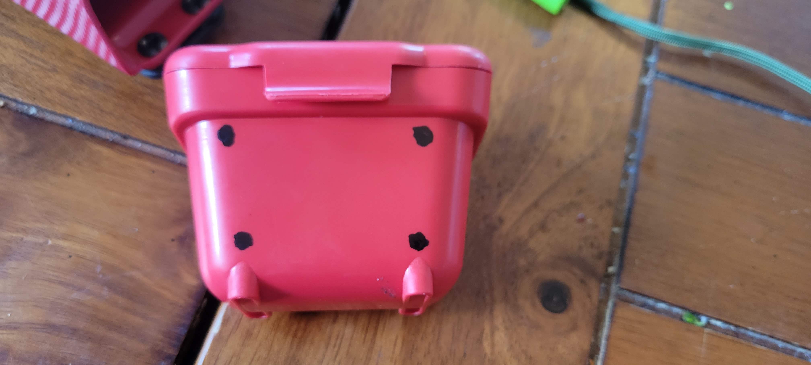

Welcome back to another how-to guide. Like my previous one will be for the purpose getting survival gear to work well for you without having to spend a lot of money.

By far, the easiest way to carry mission-critical gear without burying it all in a bag is to use a webbing rig of some kind. I have been experimenting with a molle chest rig, but more on that in a future post.

For now, I will focus on how I make affordable belt accessories more compatible with webbing.

For this example I will use these accessories:

* [MTM Ammo Belt Pouch (Red) Small](https://a.co/d/bwFDxox)

* [Clip & Carry Kydex Multitool Sheath for LEATHERMAN OHT](https://a.co/d/0AwSRyS)

The main thing is really to add holes which you can use to lash the item to the webbing. Often, you will be able to use the existing clip as well, but you will need more support if you want the item to stay on the webbing while you run, jump, and roll your way through whatever situation you've gotten yourself into.

First, mark areas on the items where the lashing won't impede with the function.

For the ammo pouch I decided to greate a basic grid of holes on the front pannel.

For the multitool holder, I realized that I could use the existing holes for the spacers to lash the item down, but would need to add a set of holes between those so as to leave at least one spacer.

Next I used the larger of the hole drills on my Dremmel to get them started.

Then I slowly widened the holes with the grindstone Dremmel attachmentes.

Finally I degreased the items with isopropyl alcohol to prep them for painting and added a layer of Rust-olem. This step is totally optional, but does help the brightly colored items blend in a bit.

And viola! Honestly, if you squint you can hardly tell they weren't custom-made molle holsters for just these purposes.

## Final Thoughts

I know molle rigs aren't everybody's cup of tea, but they definitely have their place. Also, this basic modification approach can be used for securing accessories to other systems as well. Even if that's just aiding their retention to a belt.

Also, there are definitely accessories which I have had to take other approaches with. With paracord, [web dominators](https://www.amazon.com/s?k=molle+web+dominators), and [belt keepers](https://www.amazon.com/s?k=molle+belt+keepers) there's basically no stopping you from attaching whatever you desire. This is part of the power of a molle system, in my mind.

---

> These men are all talk; What is needed is action - action!  
> **John Brown**