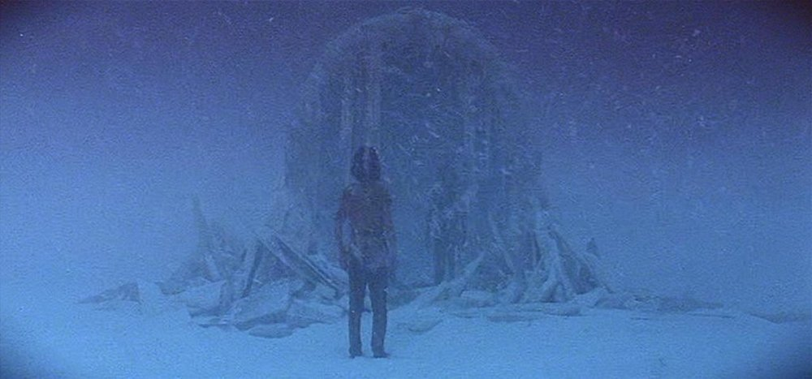

*Atreyu ponders his reflection in the Magic Mirror Gate.   [The NeverEnding Story (1984)](https://en.wikipedia.org/wiki/The_NeverEnding_Story_(film))*

## Premise

When the issues at hand are small, the consequences are minor or nonexistent. If it takes you an hour more than you thought to write up that report at work or an 15 extra minutes to arrive at your friend’s house (because you forgot that snowbirds exist) then really, who cares? **But in mentally and physically preparing for scenarios which matter, you cannot let your biases distort your perspective.**

This is a pervasive idea in the prepping community, and seems to ring true with leftists and anarchists who are focused on praxis and mutual aid. Though most preppers might be reluctant to classify themselves as [materialists](https://www.marxists.org/glossary/terms/m/a.htm#materialism), the belief in a concrete world and that we can gain an understanding of it is fundamental.

## Examples

* If you think you can carry 50 pounds of supplies on foot for distance, and you can’t. That will hurt bad if the time comes to bug out.
* If you think you are a great marksman under stress, and you’re not. You will find out, if you have to take out a target under real pressure.
* If you think you have enough supplies to feed your family for 2 months, and you don’t. They will figure it out quick when the trucks stop delivering food.

That isn’t to say that if you can’t do all those things, right now, you’re screwed. But, you need to know what you *can* do. Otherwise you will never begin properly planning, training, and preparing. You will go through your daily routine, thinking that these contingencies are covered, when the reality just isn’t there.

## What to Do About It

There are two basic things you can do to combat your own perceptions.

### 1. Mindfulness through meditation

The most effective systems I have ever found for changing perspectives about myself and my situation is through the practice of mindfulness. Mindfulness practice can be very intimidating especially if you, like me, grew up in a religious context that was fearful of “Eastern” philosophy of any kind. 

A good resource to start with is [*Mindfullness in Plain English*](https://www.amazon.com/Mindfulness-English-Bhante-Henepola-Gunaratana/dp/0861719069) by Bhante Gunaratana. But even without any studying you can begin by setting aside 10 minutes per day of peace and quiet to focus on one topic. Be that a goal, a challenging concept, or just your breath. We so rarely have time, without distraction, to think or even to not think. Any start is a good one.

### 2. Accountability through documentation

Nothing betrays the truth like inventory sheets. And one of the most humbling experiences is writing down your goals and looking back periodically to see your progress. Life is difficult, and hell-bent on getting in the way. But a system of accountability is crucial to keeping you in touch with the reality of your progress. It doesn’t have to be complex or exhaustive, but it has to be something. A notebook, a Word document, a tablet of stone etched with runes, anything will suffice. (That last one will even give some future archeologists a run for their money.)

It’s important that this documentation system not be based on success and failure in a judgemental way. It must be based on tracking progress, truthfully, and for it’s own sake. This is the only way to open yourself up to improvement without building negative emotions that will encourage you to quit the process altogether.

> But when the mental and I be moved  
> There is no longer good or bad, there just is  
> When there just is  
> You have the power to form and shape  
> **Jeru the Damaja, [Wrath of the Math](https://open.spotify.com/track/55yMsGkearEqbKhTN9i0mL?autoplay=true)**

## Conclusion

It’s always small and inconspicuous at first, but it can be a major issue when the rubber meets the road. **Your mental reality is based on your perceptions, and those are biased.** For the sake of yourself, and those you care for, you must do your best to adjust for those biases and build the most accurate picture you can. I sincerely hope that the simple, but deceptively difficult, steps outlined here can help you begin those adjustments.
